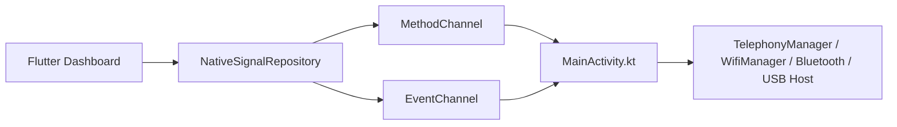

# Arquitectura de SignalScope

## Contexto

SignalScope separa la interfaz compartida en Flutter de las capacidades nativas Android expuestas mediante `MethodChannel` y `EventChannel`. La prioridad del MVP es ser tecnicamente honesto: solo muestra datos que Android publica legalmente y degrada de forma explicita cuando el hardware, permisos o plataforma no lo permiten.

## Decisiones principales

- Flutter para UI, navegacion y modo demo.
- Kotlin para acceso a telephony, Wi-Fi, Bluetooth y USB Host.
- `MethodChannel` para capacidades y acciones puntuales.
- `EventChannel` para un flujo periodico de snapshots de senales.
- Persistencia local minima con `SharedPreferences`.
- Sin backend en el MVP.
- `minSdk 26`: permite un piso razonable para BLE, restricciones modernas de Wi-Fi y soporte Android todavia util. `targetSdk` se fijo en 35 y `compileSdk` en 36 para compatibilidad con los plugins actuales de Flutter.

## Capas

- Presentacion Flutter: [dashboard_screen.dart](D:/github/herramieta-para-desastres/lib/src/features/dashboard/presentation/dashboard_screen.dart)
- Dominio de senales: [signal_models.dart](D:/github/herramieta-para-desastres/lib/src/features/signals/domain/signal_models.dart)
- Infraestructura Flutter: [native_signal_repository.dart](D:/github/herramieta-para-desastres/lib/src/features/signals/data/native_signal_repository.dart)
- Bridge Android: [MainActivity.kt](D:/github/herramieta-para-desastres/android/app/src/main/kotlin/com/signalscope/app/MainActivity.kt)

## Flujo Flutter-Kotlin

## Permisos y restricciones

- Celular: `READ_PHONE_STATE`
- Wi-Fi en Android 13+: `NEARBY_WIFI_DEVICES`
- Compatibilidad retro para Wi-Fi: `ACCESS_FINE_LOCATION` hasta API 32
- Bluetooth Android 12+: `BLUETOOTH_SCAN` y `BLUETOOTH_CONNECT`
- Nunca se usan APIs ocultas, root ni identificadores persistentes sensibles

## Riesgos conocidos

- Los fabricantes pueden ocultar o degradar campos de telephony.
- `WifiManager.connectionInfo` sigue siendo util para MVP, pero algunos detalles pueden variar entre versiones.
- Las pruebas fisicas siguen siendo necesarias para Dual SIM, throttling Wi-Fi y USB real.

## Extensibilidad SDR

La app ya reserva un modulo SDR a nivel de producto, pero el MVP solo detecta USB Host y deja el contrato listo para evolucionar a drivers concretos.
